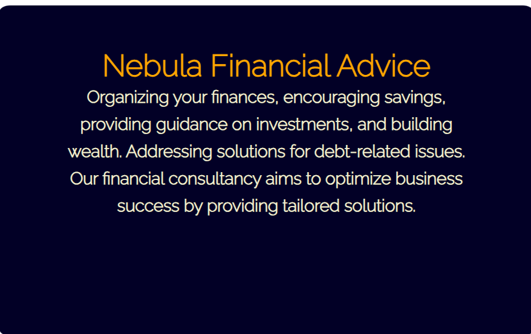
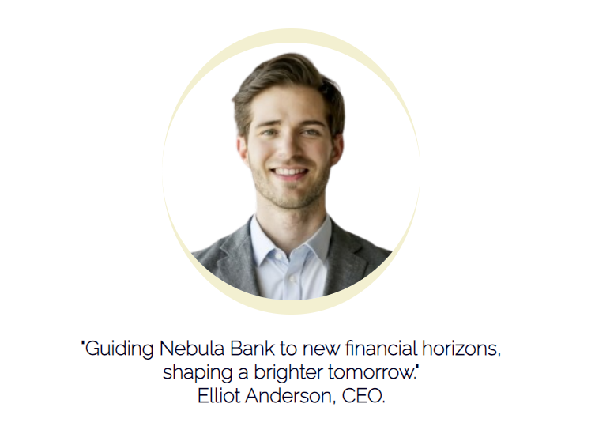
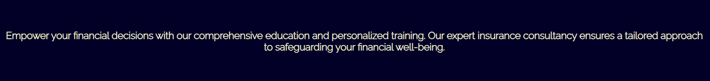
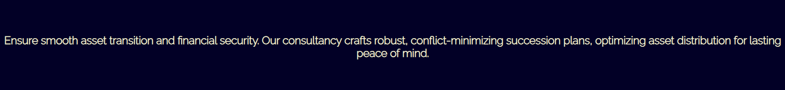
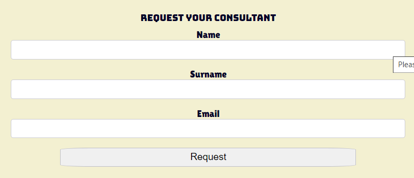
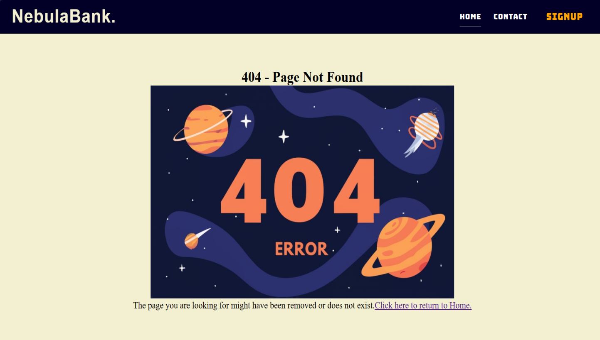
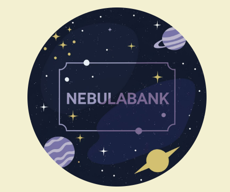

# Nebulabank
(Developer: Mario Borges)

<h2 align="center"></h2>

[View the live project here.](https://mariolfb.github.io/P1CodeInstitute/)

## Table of Content

1. [Project Goals](#project-goals)
    1. [User Goals](#user-goals)
    2. [Site Owner Goals](#site-owner-goals)
2. [User Experience](#user-experience)
    1. [Target Audience](#target-audience)
    2. [User Requrements and Expectations](#user-requrements-and-expectations)
    3. [User Stories](#user-stories)
3. [Design](#design)
    1. [Design Choices](#design-choices)
    2. [Colour](#colours)
    3. [Fonts](#fonts)
    4. [Structure](#structure)
    5. [Wireframes](#wireframes)
4. [Technologies Used](#technologies-used)
    1. [Languages](#languages)
    2. [Tools](#tools)
5. [Features](#features)
6. [Testing](#validation)
    1. [HTML Validation](#HTML-validation)
    2. [CSS Validation](#CSS-validation)
    3. [Accessibility](#accessibility)
    4. [Performance](#performance)
    5. [Device testing](#performing-tests-on-various-devices)
    6. [Browser compatibility](#browser-compatability)
    7. [Testing user stories](#testing-user-stories)
8. [Bugs](#Bugs)
9. [Deployment](#deployment)
10. [Credits](#credits)
11. [Acknowledgements](#acknowledgements)

## Project Goals 

### User Goals
- The Nebulabank aims to attract clients in search of a financial institution, offering personalized guidance for strategic decisions. It provides specialized financial consultancy for individuals and businesses..
- Seek assistance to navigate the bank's platform and easily understand the services offered through the developed Landing Page.
- Find easily accessible information about Nebulabank's customer support channels, including social media links, location, and contact details.

### Site Owner Goals
- Expand customer base by attracting individuals seeking a banking institution with advisory services.
- Enhance business visibility by promoting Nebulabank's evolution into a Financial and Investment Advisor.
- Facilitate seamless communication for both prospective and current customers to engage with the institution.
- Ensure easy access to crucial business information, fostering customer understanding and trust.

## User Experience

### Target Audience
- Individuals seeking personalized financial and investment advisory services.
- Investors interested in innovative and efficient banking solutions.
- Groups and organizations looking for a financial institution for strategic guidance.

### User Requirements and Expectations
- Quick and easy location of relevant information about financial guidance.
- Quality content presentation and visually appealing design adaptable to different screen sizes.
- Concise and easily readable content for quick understanding of service offerings.
- Accessibility, ensuring that all users can fully enjoy the financial and investment advisory platform.

### User Stories

#### First-time User 
1. As a first-time user, I want to easily find the location of the financial institution.
2. I'd like to learn more about the financial institution as a newcomer.
3. As a first-time user, I aim to gather information about the services offered.
4. I want to get a sense of what to expect when using the financial institution's services.

#### Returning User 
5. Upon returning, I want to know the operating hours of the financial institution.
6. Upon returning, I would like to access details about the offered financial services.
7. As a returning user, I want to leave comments, suggestions, or messages for the customer service team.
8. When returning, I seek information about the financial institution on social media.

#### Site Owner
9. As a returning user, I expect to get in touch to request a financial consultant.
10. Ensure that when accessing a non-existent URL, the user is redirected to the 404 error page.
11. As the owner, I want the user to access the navigation bar with ease.
12. As the owner, I want the user to view our logos. The main logo is located in the navigation bar, and the alternative logo is found on the Sign Up page.

## Design

### Design Choices
The website was crafted to provide customers with clear access to a site with a well-defined purpose and services presented in a straightforward manner. Colors and containers were employed to highlight the information effectively. The prominently featured image of the CEO serves the purpose of instilling credibility.

#### Colour Scheme
- The primary colors used in the project are Dark Navy Blue (RGB 2,0,38) and Pale Yellow (RGB 243,240,209).

### Fonts
The main font used is Raleway, and in some instances, the Bungee font is employed for additional stylization in the project. In case of any issues, the fallback font is a sans-serif.

### Structure
The website comprises 3 internal pages (Home, Signup and 404 error) and an internal anchor link to the Contact section.

- Menu Bar Structured with the Logo and 3 links (Home, Contact, and Signup).
- Contains sections with relevant information, including the company's advantages.
- Direct anchor link to the specific area at the end of the Homepage, featuring operating hours, a contact form, and a map with location and address details.
- Provides institutional information and external links to the institution's social media.
- Grants users access to an exclusive page containing a form to request the product.
- On the Homepage, there's an image of the CEO along with a message to the customer. On the Signup page, there's a logo design for the brand.

#### Wireframes

Home Page

Home Page Mobile

Sign Up Page

Sign Up Mobile

404 Error Page

## Technologies Used

### Languages
- HTML
- CSS

### Tools

1. Google Fonts: [Link](https://fonts.google.com/)
2. Font Awesome: [Link](https://fontawesome.com/)
3. Ideogram: [Link](https://ideogram.ai/)
4. GitHub: [Link](https://github.com/)
5. Draw.io: [Link](https://https://app.diagrams.net/)
6. Color Spire: [Link](https://colorspire.com/)

## Features
The page consists of three page (Home, Sign Up and 404error), an anchor link to a contact area and twelve features

### Navigation Bar
- The navigation bar exhibits complete responsiveness, transforming into a toggler (hamburger menu) when viewed on smaller screens. It encompasses links directing users to the Homepage, Contact section, and Sign Up page, facilitating seamless navigation throughout the webpage.
- User stories covered: 11 and 12

### Financial Container
- Enables users to explore tailored financial solutions, savings opportunities, investment guidance, and debt-related insights for optimized wealth building.
- User stories covered: 2 and 4

### CEO Photo and Message
- The image and message from the CEO provide users with a closer connection to a key figure in the company, aiming to instill credibility in both the product and the company itself.
- User stories covered: 6 and 9

### Advertising Container 1
- Upon viewing this container, the user gains a deeper understanding of the offered service, reinforcing and elaborating on the previously presented information.
- User stories covered: 3, 4 and 6

### Advertising Container 2
- When users delve into this container, they acquire additional and detailed insights into how the service is delivered.
- User stories covered: 4 and 6

### Get in Touch with Us
- The form provides the user with the experience of reaching out to the company.
- User stories covered: 7

### Business Hours
- Utilizing list formatting, provide the user with the company's operating hours.
- User stories covered: 5

### Company Location (Map)
- The map provides the user with accurate visual information about the company's location, instilling credibility with the customer.
- User stories covered: 1

### The footer
- Brings institutional information about the company, as well as functional external links redirecting to the external pages of the social media platforms.
- User stories covered: 8

### Sign Up Page (Request your Consultant)
- The page provides the user with the form to request the Financial Consultant. On the right side, there is a complementary logo for the project.
- User stories covered: 9 and 12

### 404 Error Page
- The benefit for the user when accessing the 404 page is receiving clear communication that the requested resource is not available, along with helpful directions for further navigation on the site. This provides a more informative and guided experience, assisting the user in easily finding what they are looking for even after the initial error.
- User stories covered: 10

### Complementary Image (Logo)
- Enhance user experience by displaying complementary images to enrich content and engagement on the website.

## Validation

### HTML Validation
The W3C Validator is employed for validating web documents, and all HTML tests were executed with significant performance.

Home

Sign Up

404 Error

### CSS Validation
The CSS Validation Service is used to check the validity of CSS code, and the test was conducted with no reported errors.

style.css

### Accessibility
The WAVE Web Accessibility Evaluation tool is used to assess web accessibility and identify potential issues, with all tests reported without problems.

Home

Sign Up

404 Error

### Performance
The Lighthouse report is utilized to evaluate web page performance, and all tests were conducted with significant performance.

Home

Sign Up

404 Error

### Performing tests on various devices 
The website underwent testing on the subsequent devices:
- Iphone 14 Pro Max
- Iphone 15 Pro
- Samsung Galaxy S23

The website was tested across various devices using Google Chrome Developer Tools.

### Browser compatability
The website underwent testing on the subsequent web browsers:
- Google Chrome
- Mozilla Firefox
- Microsoft Egde

### Testing user stories
1. As a first-time user, I want to easily find the location of the financial institution.
- Feature: Map and Footer
- Action: Go to the Contact anchor link
- Expected Result: The user will be taken directly to the section.
- Result: Operates as intended 

Screenshots

2. I'd like to learn more about the financial institution as a newcomer.
- Feature: Financial Container
- Action: Located immediately upon opening the homepage.
- Expected Result: Visible as the first piece of information.
- Result: Operates as intended 

Screenshots

3. As a first-time user, I aim to gather information about the services offered.
- Feature: Advertising Container 1
- Action: Scroll down the website. Located just below the Financial Container.
- Expected Result: Visible right after the Financial Container.
- Result: Operates as intended 

Screenshots

4. Upon returning, I would like to access details about the offered financial services.
- Feature: Advertising Container 2
- Action: Located just below Advertising Container 1. Scroll down to the center of the homepage.
- Expected Result: Visible right after the Advertising Container 1
- Result: Operates as intended 

Screenshots

4. I want to get a sense of what to expect when using the financial institution's services.
- Feature: CEO Photo and Message
- Action: Located immediately to the right of the Financial Container.
- Expected Result: Visible as the first piece of information.
- Result: Operates as intended 

Screenshots

5. Upon returning, I want to know the operating hours of the financial institution.
- Feature: Business Hours
- Action: Scroll the website towards the footer. The Business Hours container is located on the right side, just above the map.
- Expected Result: Guide the user to the mentioned section.
- Result: Operates as intended

Screenshots

6. I want to get a sense of what to expect when using the financial institution's services.
- Feature: CEO Photo and Message
- Action: Located immediately to the right of the Financial Container.
- Expected Result: Visible as the first piece of information.
- Result: Operates as intended 

Screenshots

7. As a returning user, I want to leave comments, suggestions, or messages for the customer service team. Get in Touch with Us
- Feature: Get in Touch with Us
- Action: Accessed through the anchor link 'Contact' or by scrolling down the Home Page to the footer
- Expected Result: Anchor link leads directly to the mentioned area.
- Result: Operates as intended 

Screenshots

8. When returning, I seek information about the financial institution on social media.
- Feature: Footer (social media links)
- Action: Scroll down the website until you reach the footer. Within the container, you will find the links to the social media profiles.
- Expected Result: Guide the user to the mentioned section.
- Result: Operates as intended 

Screenshots

9. As a returning user, I expect to get in touch to request a Financial Consultant.
- Feature: Sign Up Page
- Action: Located in the navigation bar. On the top right, highlighted in orange. Takes the user to the page with the consultant request form.
- Expected Result: Visible as the first piece of information.
- Result: Operates as intended 

Screenshots

10. Page 404 provides users with clear communication that the requested resource is not available, offering helpful directions for further navigation on the site.
- Feature: Page 404
- Action: The 404 page is accessed automatically when a URL doesn't correspond to any resource on the server, indicating the nonexistence of the requested page.
- Expected Result: The link to the 404 page is provided when necessary.
- Result: Operates as intended 

Screenshots

11. The navigation bar is crucial for the user experience, providing easy access to main sections and clear guidance. Its consistent presence and responsive design contribute to intuitive and efficient navigation.
- Feature: Navigation Bar
- Action: Located at the top of the website, visible immediately upon loading.
- Expected Result: Visible as the first piece of information.
- Result: Operates as intended 

Screenshots

12. As the owner, I want the user to view our logos. The main logo is located in the navigation bar, and the alternative logo is found on the Sign Up page.
- Feature: Navigation Bar and Sign Up Page
- Action: Located at the top of the website, visible immediately upon loading. Alternative logo within the Sign Up page, located to the right of the request form.
- Expected Result: Visible as the first piece of information at the top the website. Alternative logo, to be visible on the right side of the request form within the Sign Up page.
- Result: Operates as intended 

Screenshots

## Bugs

- Addressed the issue with the mainsection class to ensure proper closure of the section tag.
Resolved
- Map overload when opened on mobile devices. Add height and width to the map using a media query.
Resolved.
- The container that wraps the "Sign Up" button inside the navigation menu was not in accordance with the standard colors and accessibility contrast. Modified the color of the container and the color of the "Sign Up" button.
Resolved.
- Navigation bar, when opened on larger screens, was extending beyond the Financial Container. Added margin to the top of the Financial Container for increased spacing between the containers.
Resolved.

##   Deployment
The deployment of the website occurred through the utilization of GitHub Pages, involving the following procedures:
1. Access the Settings tab within the GitHub repository.
2. Choose the Pages option from the menu on the left.
3. Set the source branch to 'master.'
4. Following an automatic refresh of the webpage, a banner will appear at the top indicating: "Your site is live at https://mariolfb.github.io/P1CodeInstitute/.

To fork the repository, proceed with the following steps:
1. Visit the GitHub repository.
2. Click on the "Fork" button located in the upper-right corner.

To clone the repository, follow these steps:

1. Visit the GitHub repository.
2. Above the list of files, find the "Code" button and click on it.
3. Choose your preferred cloning method - HTTPS, SSH, or Github CLI - and click the copy button to copy the URL to your clipboard.
4. Open Git Bash.
5. Navigate to the directory where you want the cloned repository to be located.
6. Type "git clone" and paste the copied URL from the clipboard (e.g., $ git clone https://github.com/YOUR-USERNAME/YOUR-REPOSITORY).
7. Press Enter to create your local clone.

## Credits
- The images used (logo, CEO's picture and 404error) were artificially created and are unique. The Ideogram website was the tool used for the generation of these artificial images.
- All codes were created individually, privately and personally. I utilized the guidance and modules provided by the Code Institute with the intention of avoiding external interference, putting into practice all the content covered only by the course up to this point.
- The project was supervised and guided by Mentor Mo Shami.

