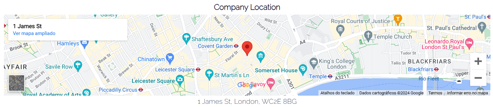

<h1 align="center">Nebulabank</h1>

[View the live project here.](https://mariolfb.github.io/P1CodeInstitute/)

Introducing Nebulabank, an online financial institution focused on efficiency and innovation. Our goal is to provide accessible, secure, and convenient banking services. Our aim is to simplify the banking experience to meet modern demands.

<h2 align="center"></h2>

## User Experience (UX)

### User stories

#### First Time Visitor Goals

1. Clearly understand that the product is a new online bank.
2. View the advantages the company provides.
3. Quickly access the navigation menu, which includes options to contact and locate the company.
4. Direct and prominently featured link in the navigation menu to acquire the product.

#### Returning Visitor Goals

1. Establish closer contact with potential clients through communication channels, address, and social media.
2. Explore additional details about the benefits of the bank account.
3. Initiate the process of requesting a bank account and explore opportunities for referring new clients.

#### Frequent User Goals

1. Access updated information on investment opportunities and enhancements for managing the bank account.
2. As a user of a financial institution, the primary aim is to establish more direct and prompt means of communication.
3. Receive timely information about news and updates related to the financial market.

### Design

#### Colour Scheme

- The primary colors used in the project are Dark Navy Blue and Pale Yellow.

#### Typography

- The main font used is Raleway, and in some instances, the Bungee font is employed for additional stylization in the project. In case of any issues, the fallback font is a sans-serif.

#### Imagery

- The main image on the home page features the CEO of the company, aiming to instill credibility in the product and brand. On the SignUp page, an alternative image of the project's logo is used to provide a visually appealing aspect for the user.

#### Wireframes

1. Home Page - 
1.1 Home Page Mobile - 
2. Sign Up Page - 
2.1. Sign Up Mobile - 

#### Tools Used

1. Google Fonts: [Link](https://fonts.google.com/)
2. Font Awesome: [Link](https://fontawesome.com/)
3. Ideogram: [Link](https://ideogram.ai/)
4. GitHub: [Link](https://github.com/)
5. Draw.io: [Link](https://https://app.diagrams.net/)
6. Favicon: [Link](https://Favicon.io/)

#### Technologies Used

1. HTML
2. CSS

## Structure

- The website comprises 2 internal pages (Home and Signup) and an internal anchor link to the Contact section.

1. **Menu Bar:** Structured with the Logo and 3 links (Home, Contact, and Signup).
2. **Home:** Contains sections with relevant information, including the company's advantages.
3. **Contact:** Direct anchor link to the specific area at the end of the Homepage, featuring operating hours, a contact form, and a map with location and address details.
4. **Footer:** Provides institutional information and external links to the institution's social media.
5. **Signup Page:** Grants users access to an exclusive page containing a form to request the product.
6. **Images:** On the Homepage, there's an image of the CEO along with a message to the customer. On the Signup page, there's a logo design for the brand.

### Navigation Bar (Logo, Home, Contact, and Signup):

- The entire navigation bar is fully responsive.

1. Logo (internal anchor link to the homepage)
2. Home (internal anchor link to the homepage)
3. Contact (internal anchor link to the designated area within the Home)
4. Signup (Link to the Signup page)

### Landing Page (Product Advantages and Benefits, CEO's Message, and Additional Benefit Messages to Capture Clients):

#### Section 1

1. Introduction about the Bank's Benefits
2. CEO's Message to Users

#### Section 2

1. Message to promote the bank app
2. Message regarding financial investment

### Contact Area (Get in Touch with Us, Business Hours, and Company Location):

#### Get in Touch with Us

- The form provides the user with the experience of reaching out to the company.

#### Business Hours

- Utilizing list formatting, provide the user with the company's operating hours.

#### Company Location (Map)

- The map provides the user with accurate visual information about the company's location, instilling credibility with the customer.

### The footer

- Brings institutional information about the company, as well as functional external links redirecting to the external pages of the social media platforms.

### Sign Up Page

- The page provides the user with the form to request the product on the left side. On the right side, there is a complementary logo for the project.

### Future updates area

- Section reserved for future updates.
